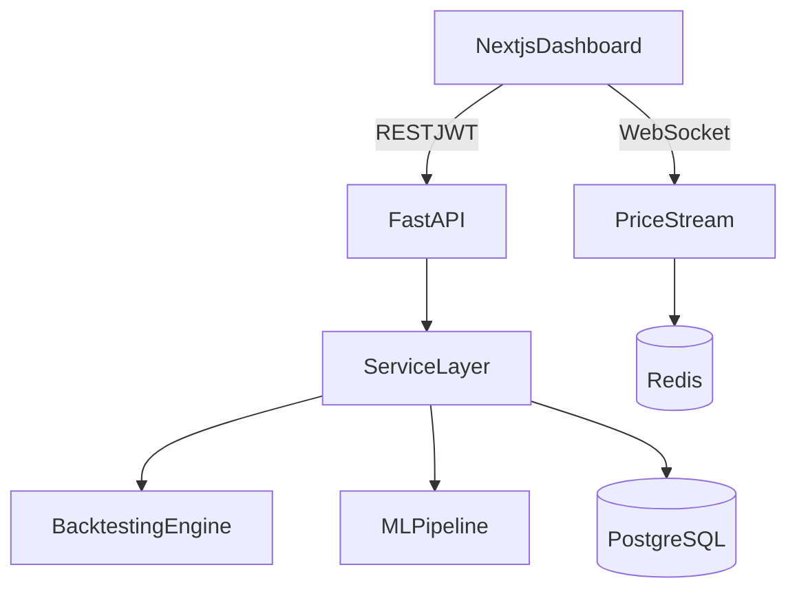

# QuantLab

QuantLab is a production-style full-stack trading and market analysis platform for portfolio demonstration.  
It combines a Python backtesting engine, FastAPI services, Next.js analytics dashboard, PostgreSQL persistence, Redis-powered realtime feeds, and a classical ML prediction pipeline.

## Architecture



## Monorepo

- `frontend/` Next.js + React + TypeScript + Tailwind + Plotly
- `backend/` FastAPI + SQLAlchemy + Alembic + Pandas/NumPy + scikit-learn
- `infra/` docker-compose, env templates, nginx
- `docs/` architecture, API, backtesting engine, ML module docs

## Prerequisites

- [Docker Desktop](https://www.docker.com/products/docker-desktop/) (includes Docker Compose v2)
- Optional: GNU `make`, if you want to use the repo `Makefile` targets

All commands below assume the repository root as the working directory.

## Local setup (Docker Compose)

The compose file lives at `infra/docker-compose.yml` and loads variables from `infra/.env.example` (or copy it to `infra/.env` and point `--env-file` at that file for local secrets).

### 1. Start the stack

**One-shot (bash):** from repo root, run all startup steps (compose up, wait for DB/API, `create_all`, Alembic, seed):

```bash
bash scripts/docker-up.sh
```

On Linux/macOS you can `chmod +x scripts/docker-up.sh` and then `./scripts/docker-up.sh`.

Using Make:

```bash
make up
```

Or explicitly (PowerShell / bash):

```bash
docker compose --env-file infra/.env.example -f infra/docker-compose.yml up -d --build
```

### 2. Database schema

SQLAlchemy creates tables when the API process imports `app.main` (`Base.metadata.create_all`). **Start the backend once** and confirm it is healthy before seeding:

```bash
docker compose --env-file infra/.env.example -f infra/docker-compose.yml logs --tail=50 backend
```

**Alembic:** Initial migration revisions may not be committed yet. The `make migrate` target sets `PYTHONPATH=/app` so Alembic can import the `app` package. After you add files under `backend/alembic/versions/`, run:

```bash
make migrate
```

Or:

```bash
docker compose --env-file infra/.env.example -f infra/docker-compose.yml exec backend sh -lc "PYTHONPATH=/app alembic upgrade head"
```

If you need to create tables manually (e.g. before the API has started successfully):

```bash
docker compose --env-file infra/.env.example -f infra/docker-compose.yml exec backend python -c "from app.models.base import Base; from app.db.session import engine; Base.metadata.create_all(bind=engine)"
```

### 3. Seed demo user

```bash
make seed
```

Or:

```bash
docker compose --env-file infra/.env.example -f infra/docker-compose.yml exec backend python -m app.db.seed
```

### 4. Open the app

- Frontend: [http://localhost:3000](http://localhost:3000) (redirects to `/login`)
- API docs (Swagger): [http://localhost:8000/docs](http://localhost:8000/docs)

**Demo login**

- Email: `demo@quantlab.dev`
- Password: `demo1234`

### 5. Stop the stack

**Bash helper (samme `infra/.env` / `.env.example` som `docker-up.sh`):**

```bash
bash scripts/docker-down.sh
```

Slett også Postgres-volum (blank database neste gang):

```bash
bash scripts/docker-down.sh --volumes
```

Using Make:

```bash
make down
```

Or:

```bash
docker compose --env-file infra/.env.example -f infra/docker-compose.yml down
```

### Rebuild after dependency changes

If you change `backend/requirements.txt` or frontend `package.json`, rebuild images:

```bash
docker compose --env-file infra/.env.example -f infra/docker-compose.yml build --no-cache backend frontend
docker compose --env-file infra/.env.example -f infra/docker-compose.yml up -d
```

## Troubleshooting

| Symptom | Likely cause | What to try |
|--------|----------------|-------------|
| `localhost:3000` is blank or refuses connection | Frontend container crashed | `docker compose ... logs frontend` — Next.js expects `frontend/next.config.mjs` (not `next.config.ts` in this Node image). |
| `ModuleNotFoundError: No module named 'app'` when running Alembic | Python path inside container | Use `make migrate` or prefix with `PYTHONPATH=/app` (already wired in the Makefile). |
| `relation "users" does not exist` when running seed | Tables not created yet | Start backend successfully or run the `create_all` one-liner in section 2. |
| `email-validator is not installed` | Missing optional Pydantic email dependency | Rebuild backend after pulling `email-validator` in `requirements.txt`. |
| bcrypt / passlib errors during seed | `bcrypt` too new for `passlib` | `backend/requirements.txt` pins `bcrypt==4.0.1`; rebuild the backend image. |

## Example API endpoints

- `POST /api/v1/auth/register`
- `POST /api/v1/auth/login`
- `GET /api/v1/datasets`
- `POST /api/v1/datasets/upload`
- `POST /api/v1/backtests`
- `GET /api/v1/backtests`
- `GET /api/v1/strategies`
- `POST /api/v1/ml/train`
- `WS /api/v1/ws/prices`

## Screenshots

- `docs/screenshots/dashboard-overview.png` (recommended capture: `/dashboard`)
- `docs/screenshots/backtest-detail.png` (recommended capture: `/dashboard/backtests/{id}`)
- `docs/screenshots/ml-results.png` (recommended capture: `/dashboard/ml`)

Current UI now includes:
- Auth flow (`/login`, `/register`)
- Dataset upload + listing
- Backtest run flow with detail charts (equity + drawdown) and trade table
- ML training view with confusion matrix + feature importance
- Live WebSocket watchlist on dashboard home
- Table polish: pagination, search/filter and sorting on key views
- Stronger client-side form validation and inline field errors
- Improved backend error parsing (FastAPI `detail` string/array handling)

## Engineering decisions

- Layered backend architecture keeps business logic out of route handlers.
- Strategy pattern makes backtesting engine extensible.
- Typed frontend API client keeps API contracts explicit.
- ML module is separated from API routes for maintainability and testability.

## Roadmap

- Real broker integration adapter
- Advanced portfolio optimization
- Multi-asset and intraday support
- Celery background jobs for long-running backtests
- Role-based auth and team workspaces

## Suggested GitHub issues

1. Add async task queue for heavy backtests and ML training
2. Add comprehensive Alembic migrations with seed revisions
3. Add websocket fallback and heartbeat handling
4. Add strategy parameter validation schemas and UI forms
5. Add benchmark data provider adapters (Polygon, Binance, AlphaVantage)
6. Add portfolio/account ledger and transaction journal
7. Add Playwright E2E for auth + backtest run flow
8. Add model registry and persisted ML model artifacts
9. Add observability stack (OpenTelemetry + Prometheus/Grafana)
10. Add deployment manifests for Fly.io/Render/Kubernetes